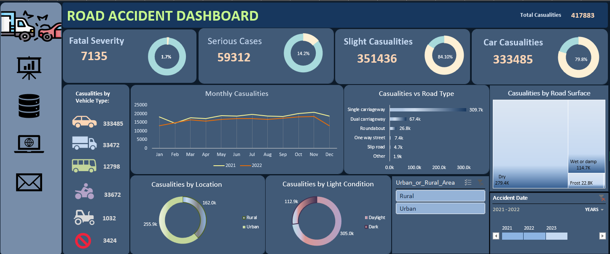

 Road Accident Analysis Dashboard

 Project Overview

This project presents an interactive **Road Accident Analysis Dashboard** created using Microsoft Excel.

The dashboard analyzes road accident data to identify accident patterns, casualties, severity, time trends, and other important factors. The goal is to transform raw accident data into meaningful and easy-to-understand visual insights.

 Objectives

- Analyze overall road accident trends
- Understand accident and casualty patterns
- Analyze accident severity
- Identify trends based on time
- Compare different accident-related factors
- Create an interactive and user-friendly dashboard
- Present key insights using KPIs and charts

 Tools & Technologies
Microsoft Excel
- Pivot Tables
- Pivot Charts
- Excel Formulas
- Slicers
- Conditional Formatting
- Data Visualization
- Dashboard Design

Dashboard Features

 Main Dashboard
Provides an overview of the road accident data using:

- KPI Cards
- Accident statistics
- Casualty statistics
- Accident severity analysis
- Interactive filters
- Charts and visualizations

 2. Insights
The insights page highlights important findings from the data and helps understand major accident patterns.

 Key KPIs

The dashboard includes important performance indicators such as:

- Total Accidents
- Total Casualties
- Fatal Casualties
- Serious Casualties
- Slight Casualties
- Accident Severity

---

 Analysis Performed

The project explores accident data across different dimensions such as:

- Accident severity
- Time period
- Casualty type
- Road conditions
- Weather conditions
- Vehicle-related factors
- Other available accident attributes

---
 Project Files

| File | Description |
|------|-------------|
| `Road_accident_Dashboard.xlsx` | Excel workbook containing the interactive dashboard |
| `Road_accident_Dashboard.png` | Preview image of the dashboard |
| `README.md` | Project documentation |

 Dashboard Preview

 Project Outcome

This project demonstrates how Excel can be used to transform raw data into an interactive analytical dashboard and communicate data-driven insights through effective visualization.

Author

**Vaishnavi More**

Data Analytics Enthusiast

📍 Maharashtra, India
